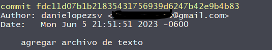
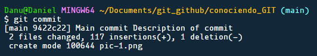
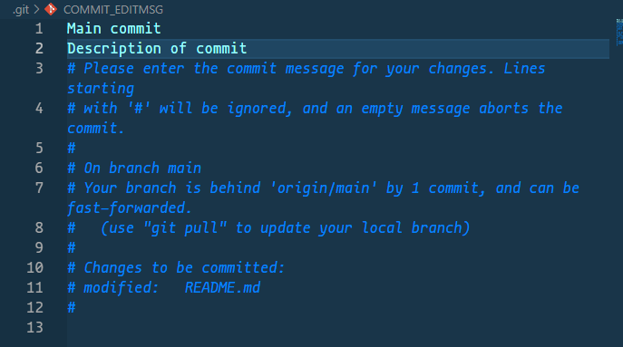
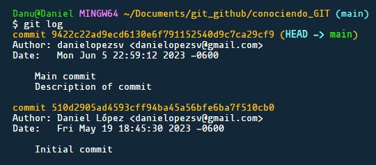

# GIT and GITHUB

<hr>

### Fundamentos en la terminal

- **pwd**: Conocer donde se encuentra el user

- **cd .. "file name"**: para desplazarse a un directorio dentro del local

- **mkdir _directory-name_**: para crear un directorio donde se encuentra el user

- **rmdir _directory-name_**: para eliminar un directorio donde se encuentra el user

- **touch _file-name_**: para crear un archivo(file) en el espacio de trabajo del user

- **rm _file-name_**: para eliminar un archivo (file) donde se encuentra el user

- **cat _file-name_**: para ver el contendido de un archivo

- **ls**: para conocer los archivos que estan dentro de la carpeta donde esta el user

- **history**: los comandos utilizados durante un periodo de tiempo

### GIT COMMAND

#### **USER CONFIGURE**

- Conocer la versión instalada en equipo

  ```
  git --version
  ```

- configuracion global de usuario

  ```
  git config --global user.name "user name"
  ```

- configuracion global de correo

  ```
  git config --global user.email "user.name@mail.com"
  ```

- configuracion solo para un repositorio

  ```
  git config user.name "user name"
  ```

- configuracion solo para un repositorio

  ```
  git config user.email "user.name@mail.com"
  ```

- Iniciar repositorio

  ```
  git init
  ```

- Cambio de master a main
  ```
  git config --global init.defaulBranch main
  ```
  Se borra el archivo .git oculto y se realiza el "git init"

#### LAS 3 AREAS DE GIT

| Directorio de trabajo                                 | Area de Preparada                                                            | Repositorio                                                                                        |
| ----------------------------------------------------- | ---------------------------------------------------------------------------- | -------------------------------------------------------------------------------------------------- |
| Working Directory                                     | Staged                                                                       | Repository                                                                                         |
| Estados modificados localmente pero no son rastreados | Estan en una etapa que estan listos para que sean ubicados en un repositorio | **commit** Archivos agregados en repositorios y marca un punto de salida, para que sean rastreados |
| _no staged_                                           | _process_                                                                    | _commit_                                                                                           |

#### GIT STATUS

Conocer el estado de un directorio/archivo siempre y cuando hayan sido colocados en el Staged.

- opcion para agregar al staged un archivo en especifico

  ```
  git add "file_name"
  ```

- opcion para agregar de manera general

  ```
  git add .
  ```

- remover del staged (estado de preparacion)
  ```
  git rm --cached "name file"
  ```

#### QUE ES UN COMMIT

En una línea de tiempo se toma un fotografía, un registro o cambio en ese archivo; el cual se podrá rastrear en los registros que se realicen
Almacedos con el metodo HASH describiendo cuando se realizó, donde se realizo y quien lo realizo.

**SHA**: Secure Hash Algorithms

- commit en línea de comando

```
git commit -m "description of track or job"
```



- commit en editor de trabajo (siempre y cuando se haya configurado)
  se abre una pagina en el IDE y se podra comentar el commit y al cerrar la pagina, automaticamente se guarda los cambios

  ```
  git commit (dar enter)
  ```

  

- conocer los cambios realizados durante el periodo de trabajo
  ```
  git log
  ```
  
